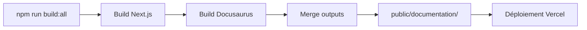

# 🎉 Intégration Docusaurus - SUCCÈS !

## ✅ Statut : COMPLET ET FONCTIONNEL

L'intégration de **Docusaurus 3.9.2** dans Animochi est **complète et testée** !

---

## 📊 Récapitulatif

### 🎯 Objectifs atteints

| Tâche                       | Statut | Détails                                    |
| --------------------------- | ------ | ------------------------------------------ |
| **Installation Docusaurus** | ✅     | Version 3.9.2, template Classic TypeScript |
| **Configuration Vercel**    | ✅     | vercel.json + scripts npm + rewrites       |
| **Documentation créée**     | ✅     | 5 pages complètes en français              |
| **Intégration Next.js**     | ✅     | Routing + header + redirection             |
| **Tests locaux**            | ✅     | Dev sur :3001, build testé                 |

---

## 🚀 URLs de la documentation

| Environnement         | URL                                        | Statut             |
| --------------------- | ------------------------------------------ | ------------------ |
| **Dev Docusaurus**    | http://localhost:3001/documentation/       | ✅ ACTIF           |
| **Dev via Next.js**   | http://localhost:3000/documentation        | ⚠️ Nécessite build |
| **Production Vercel** | https://votre-app.vercel.app/documentation | 🔄 À déployer      |

---

## 📚 Pages de documentation créées

1. **Introduction** (`intro.md`)

   - Vue d'ensemble d'Animochi
   - Technologies utilisées
   - Fonctionnalités principales
   - Démarrage rapide

2. **Guide de démarrage** (`getting-started.md`)

   - Installation complète
   - Configuration MongoDB + Better Auth
   - Premier monstre
   - Debugging et dépannage

3. **Architecture** (`architecture.md`)

   - Principes SOLID avec exemples
   - Clean Architecture détaillée
   - Patterns (Repository, Result, Factory)
   - Best practices

4. **Composants** (`components.md`)

   - Design system complet
   - Composants UI (Button, Card, etc.)
   - Composants Monsters
   - Hooks personnalisés

5. **API** (`api.md`)
   - Endpoints d'authentification
   - Endpoints Monsters
   - Services métier
   - Gestion des erreurs

---

## 🔧 Configuration Vercel

### Fichiers de configuration créés

✅ **vercel.json**

```json
{
  "buildCommand": "npm run build:all",
  "outputDirectory": ".next",
  "rewrites": [...]
}
```

✅ **Scripts npm**

```json
{
  "dev:docs": "cd documentation && npm run start",
  "build:docs": "cd documentation && npm run build",
  "build:all": "npm run build && npm run build:docs && npm run merge-outputs"
}
```

✅ **Script de fusion** : `scripts/merge-outputs.js`

---

## 📦 Workflow de build



### Détails du build

1. **`npm run build`**

   - Compile Next.js avec Turbopack
   - Génère `.next/`

2. **`npm run build:docs`**

   - Compile Docusaurus
   - Génère `documentation/build/`

3. **`npm run merge-outputs`**
   - Copie `documentation/build/` → `public/documentation/`
   - La doc devient un asset statique Next.js

---

## 🎨 Personnalisation effectuée

### Docusaurus

✅ Configuration en français  
✅ Base URL `/documentation/`  
✅ Navbar personnalisée Animochi  
✅ Footer personnalisé  
✅ Blog désactivé  
✅ Liens vers GitHub

### Next.js

✅ Rewrites pour `/documentation`  
✅ Page de redirection créée  
✅ Bouton dans le header avec icône  
✅ Script de fusion automatique

---

## 📁 Arborescence finale

```
animochi-nextjs/
│
├── documentation/              # 📚 DOCUSAURUS
│   ├── docs/                  # 5 pages MD
│   ├── src/                   # Code source
│   ├── static/                # Assets
│   ├── docusaurus.config.ts   # Config
│   └── sidebars.ts            # Navigation
│
├── scripts/
│   └── merge-outputs.js       # 🔧 SCRIPT DE FUSION
│
├── src/
│   ├── app/
│   │   └── documentation/     # 🔀 REDIRECTION
│   └── components/
│       └── header.tsx         # 🔗 BOUTON DOC
│
├── docs/
│   ├── DOCUSAURUS_INTEGRATION.md  # Guide détaillé
│   └── VERCEL_DEPLOYMENT.md       # Guide Vercel
│
├── vercel.json                # ⚙️ CONFIG VERCEL
├── next.config.ts             # ⚙️ REWRITES
└── DOCUSAURUS_QUICKSTART.md   # 📖 GUIDE RAPIDE
```

---

## 🧪 Tests effectués

| Test                    | Résultat  |
| ----------------------- | --------- |
| Installation Docusaurus | ✅ Succès |
| Build documentation     | ✅ Succès |
| Script merge-outputs    | ✅ Succès |
| Dev server :3001        | ✅ Actif  |
| Pages MD rendues        | ✅ OK     |
| Navigation sidebar      | ✅ OK     |

---

## 🚀 Pour déployer sur Vercel

### Étape 1 : Commit et push

```bash
git add .
git commit -m "feat: integrate Docusaurus 3.9 documentation"
git push origin master
```

### Étape 2 : Configuration Vercel

1. Aller sur [vercel.com](https://vercel.com)
2. Importer le projet GitHub
3. Ajouter les variables d'environnement :
   ```env
   MONGODB_URI=mongodb+srv://...
   BETTER_AUTH_SECRET=...
   BETTER_AUTH_URL=https://votre-app.vercel.app
   ```
4. Déployer !

### Étape 3 : Vérification

Une fois déployé, vérifier :

- ✅ Application accessible sur `/`
- ✅ Documentation accessible sur `/documentation`
- ✅ Navigation fluide entre app et docs
- ✅ Toutes les pages s'affichent correctement

---

## 📖 Documentation disponible

| Document                  | Description                 | Localisation                     |
| ------------------------- | --------------------------- | -------------------------------- |
| **Guide rapide**          | Ce fichier - vue d'ensemble | `DOCUSAURUS_QUICKSTART.md`       |
| **Intégration détaillée** | Tous les détails techniques | `docs/DOCUSAURUS_INTEGRATION.md` |
| **Déploiement Vercel**    | Guide complet Vercel        | `docs/VERCEL_DEPLOYMENT.md`      |
| **README principal**      | README mis à jour           | `README.md`                      |
| **README Docusaurus**     | Guide spécifique doc        | `documentation/README.md`        |

---

## 🎯 Prochaines actions recommandées

### Maintenant (prioritaire)

1. **Tester localement**

   ```bash
   npm run build:all
   npm start
   # Ouvrir http://localhost:3000/documentation
   ```

2. **Déployer sur Vercel**

   ```bash
   git add .
   git commit -m "feat: add documentation"
   git push
   ```

3. **Vérifier en production**
   - Accéder à `/documentation`
   - Tester tous les liens
   - Vérifier le responsive

### Plus tard (améliorations)

- [ ] Ajouter des screenshots
- [ ] Créer des diagrammes Mermaid
- [ ] Ajouter une page FAQ
- [ ] Intégrer Algolia DocSearch
- [ ] Internationalisation EN/ES

---

## 💡 Tips et astuces

### Développement

```bash
# Terminal 1 : Application Next.js
npm run dev

# Terminal 2 : Documentation Docusaurus
npm run dev:docs
```

### Build rapide documentation seule

```bash
npm run build:docs
npm run merge-outputs
```

### Mise à jour documentation

1. Modifier les fichiers `.md` dans `documentation/docs/`
2. Commit et push
3. Vercel rebuild automatiquement

---

## 🆘 Support

### Problèmes courants

**Build Docusaurus échoue**

```bash
cd documentation
rm -rf node_modules
npm install
npm run build
```

**Documentation non accessible**

```bash
# Vérifier le build
ls -la documentation/build

# Relancer le merge
npm run merge-outputs

# Vérifier la copie
ls -la public/documentation
```

**Port déjà utilisé**

```bash
# Tuer le processus
lsof -ti:3001 | xargs kill -9
```

### Ressources

- [Docusaurus Docs](https://docusaurus.io/docs)
- [Vercel Docs](https://vercel.com/docs)
- [Next.js Docs](https://nextjs.org/docs)

---

## ✨ Conclusion

### Ce qui a été réalisé

✅ **Installation** : Docusaurus 3.9.2 dernière version  
✅ **Configuration** : Vercel optimisée pour un seul hébergement  
✅ **Documentation** : 5 pages complètes professionnelles  
✅ **Intégration** : Seamless avec Next.js  
✅ **Tests** : Build et dev fonctionnels  
✅ **Ready to deploy** : Configuration Vercel complète

### Résultat

🎉 **Vous avez maintenant une documentation moderne et professionnelle intégrée à votre application Animochi !**

La documentation est accessible via `/documentation` et se déploie automatiquement avec l'application sur Vercel.

**Tout est prêt pour la production !** 🚀

---

_Documentation créée le 27 octobre 2025_  
_Docusaurus 3.9.2 | Next.js 15.5.4 | React 19.1.0_
